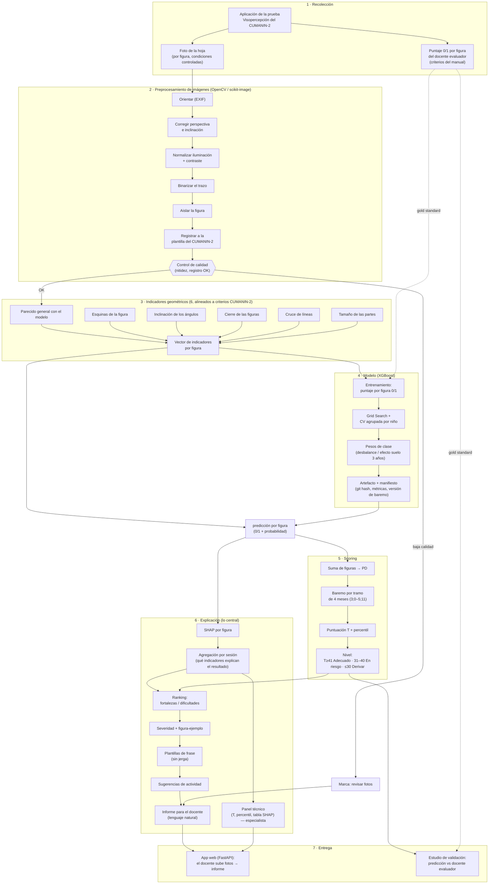
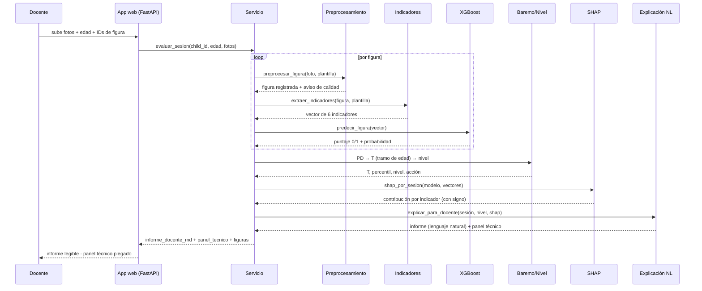
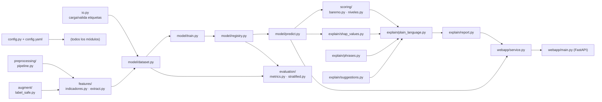

# Arquitectura de la metodología

Sistema de evaluación grafomotora infantil por **visión computacional + XGBoost**, con
una capa de **explicación en lenguaje natural para el docente**. Niños de **3 a 5 años**,
prueba **Visopercepción (Vis) del CUMANIN‑2**.

---

## 1. Vista general (flujo completo)

---

## 2. Flujo en tiempo de inferencia (un niño en la app)

---

## 3. Componentes (paquete `grafomotor`)

---

## 4. CRISP‑DM ↔ módulos

| Fase CRISP‑DM | Aquí | Módulos |
|---|---|---|
| Comprensión del negocio | evaluación grafomotora objetiva y accesible en aula | — |
| Comprensión de los datos | `00_validar_datos.py` (desbalance, efecto suelo, tramos) | `io.py` |
| Preparación de los datos | preprocesamiento de imágenes + 6 indicadores + aumento seguro | `preprocessing/`, `features/`, `augment/` |
| Modelado | XGBoost por figura, CV agrupada por niño, Grid Search | `model/` |
| Evaluación | F1 por figura, QWK del nivel, Bland‑Altman de PD, estratificado por tramo | `evaluation/` |
| Despliegue | app web + informe en lenguaje natural para el docente | `explain/`, `webapp/` |

---

## 5. Decisiones clave

- **Target de entrenamiento = 0/1 por figura** (no el nivel global): ~1 500 etiquetas
  en vez de ~150. El nivel se **deriva** (PD → baremo por edad → T → banda del CUMANIN‑2).
- **2 clases por defecto** (Adecuado / En riesgo, corte T ≤ 40); 3 clases si "Muy bajo"
  reúne suficientes casos. Se decide con la distribución real.
- **CV agrupada por niño**: ningún niño en train y test a la vez.
- **Aumento de datos que preserva la etiqueta**: nada de rotaciones amplias ni volteos
  (cambiarían los criterios de puntuación del CUMANIN‑2).
- **Explicación determinista por plantillas** (reproducible para la tesis); *hook* de
  pulido por LLM desactivado.
- **Separación estricta**: narrativa para el docente ≠ panel técnico (T, percentil, SHAP).
