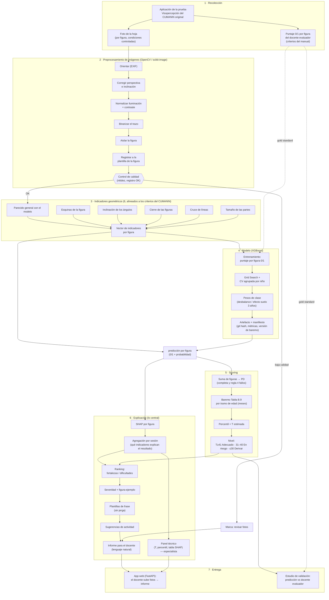
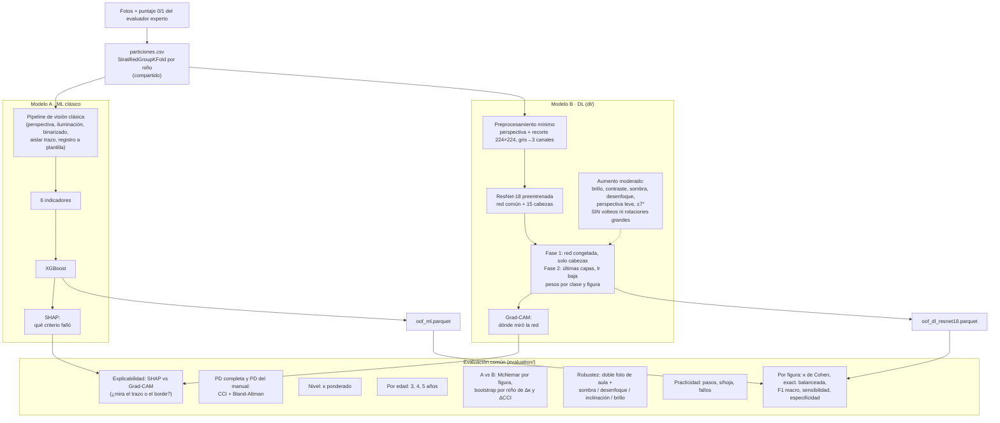
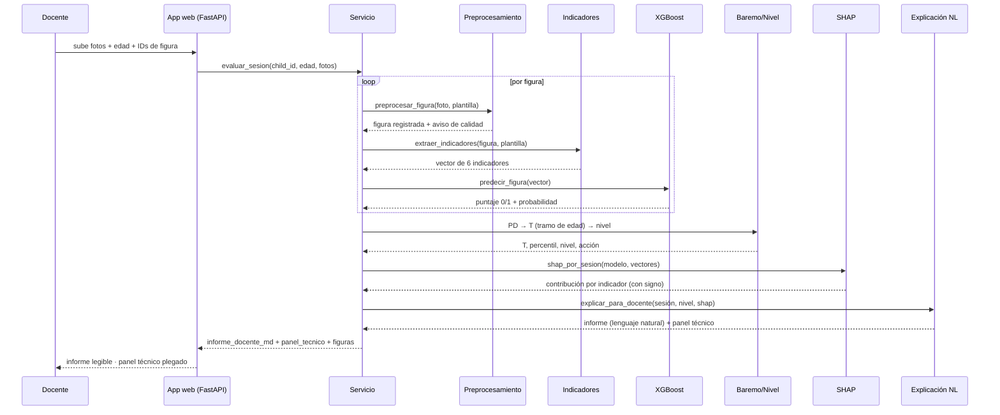
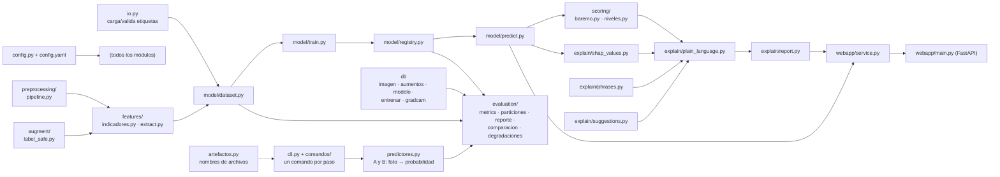

# Arquitectura de la metodología

Diseño comparativo (decisión del 30/09/2026): **modelo A** (visión clásica + 6 indicadores
+ XGBoost + SHAP) frente a **modelo B** (ResNet-18 + Grad-CAM), con los mismos datos.
Niños de **3 a 5 años**, escala de **Visopercepción del CUMANIN original**. Las secciones
1–3 describen el modelo A y la app; la sección 1b, el modelo B y la comparación.

---

## 1. Vista general (flujo completo)

```mermaid
flowchart TD
    subgraph REC["1 · Recolección"]
        A1["Aplicación de la prueba<br/>Visopercepción del CUMANIN original"] --> A2["Foto de la hoja<br/>(por figura, condiciones controladas)"]
        A1 --> A3["Puntaje 0/1 por figura<br/>del docente evaluador<br/>(criterios del manual)"]
    end

    subgraph PRE["2 · Preprocesamiento de imágenes  (OpenCV / scikit-image)"]
        B1["Orientar (EXIF)"] --> B2["Corregir perspectiva<br/>e inclinación"] --> B3["Normalizar iluminación<br/>+ contraste"] --> B4["Binarizar el trazo"] --> B5["Aislar la figura"] --> B6["Registrar a la<br/>plantilla de la figura"]
        B6 --> BQ{{"Control de calidad<br/>(nitidez, registro OK)"}}
    end

    subgraph FEA["3 · Indicadores geométricos  (6, alineados a los criterios del CUMANIN)"]
        C1["Parecido general con el modelo"]
        C2["Esquinas de la figura"]
        C3["Inclinación de los ángulos"]
        C4["Cierre de las figuras"]
        C5["Cruce de líneas"]
        C6["Tamaño de las partes"]
        C1 & C2 & C3 & C4 & C5 & C6 --> CV["Vector de indicadores<br/>por figura"]
    end

    subgraph MOD["4 · Modelo  (XGBoost)"]
        D1["Entrenamiento:<br/>puntaje por figura 0/1"] --> D2["Grid Search +<br/>CV agrupada por niño"]
        D2 --> D3["Pesos de clase<br/>(desbalance / efecto suelo 3 años)"]
        D3 --> D4["Artefacto + manifiesto<br/>(git hash, métricas, versión de baremo)"]
    end

    subgraph SCO["5 · Scoring"]
        E1["Suma de figuras → PD<br/>(completa y regla 4 fallos)"] --> E2["Baremo Tabla B.9<br/>por tramo de edad (meses)"] --> E3["Percentil + T estimada"] --> E4["Nivel:<br/>T≥41 Adecuado · 31–40 En riesgo · ≤30 Derivar"]
    end

    subgraph EXP["6 · Explicación  (lo central)"]
        F1["SHAP por figura"] --> F2["Agregación por sesión<br/>(qué indicadores explican el resultado)"]
        F2 --> F3["Ranking:<br/>fortalezas / dificultades"]
        F3 --> F4["Severidad + figura-ejemplo"]
        F4 --> F5["Plantillas de frase<br/>(sin jerga)"]
        F5 --> F6["Sugerencias de actividad"]
        F6 --> F7["Informe para el docente<br/>(lenguaje natural)"]
        F2 --> G1["Panel técnico<br/>(T, percentil, tabla SHAP) — especialista"]
    end

    subgraph OUT["7 · Entrega"]
        H1["App web (FastAPI):<br/>el docente sube fotos → informe"]
        H2["Estudio de validación:<br/>predicción vs docente evaluador"]
    end

    A2 --> B1
    BQ -->|OK| C1
    BQ -->|baja calidad| F0["Marca: revisar fotos"] --> F7
    CV --> D1
    CV --> P1["predicción por figura<br/>(0/1 + probabilidad)"]
    D4 --> P1
    P1 --> E1
    P1 --> F1
    E4 --> F3
    E4 --> H2
    A3 -.gold standard.-> D1
    A3 -.gold standard.-> H2
    F7 --> H1
    G1 --> H1
```

---

## 1b. Modelo B y comparación A vs B

```mermaid
flowchart TD
    R["Fotos + puntaje 0/1 del evaluador experto"] --> P["particiones.csv<br/>StratifiedGroupKFold por niño<br/>(compartido)"]

    subgraph A["Modelo A · ML clásico"]
        A1["Pipeline de visión clásica<br/>(perspectiva, iluminación, binarizado,<br/>aislar trazo, registro a plantilla)"] --> A2["6 indicadores"] --> A3["XGBoost"] --> A4["SHAP:<br/>qué criterio falló"]
    end

    subgraph B["Modelo B · DL  (dl/)"]
        B1["Preprocesamiento mínimo<br/>perspectiva + recorte 224×224, gris→3 canales"] --> B2["ResNet-18 preentrenada<br/>red común + 15 cabezas"]
        B2 --> B3["Fase 1: red congelada, solo cabezas<br/>Fase 2: últimas capas, lr baja<br/>pesos por clase y figura"]
        B3 --> B4["Grad-CAM:<br/>dónde miró la red"]
        AUG["Aumento moderado:<br/>brillo, contraste, sombra, desenfoque,<br/>perspectiva leve, ±7°<br/>SIN volteos ni rotaciones grandes"] -.-> B3
    end

    P --> A1
    P --> B1
    A3 --> OA["oof_ml.parquet"]
    B3 --> OB["oof_dl_resnet18.parquet"]

    subgraph C["Evaluación común  (evaluation/)"]
        C1["Por figura: κ de Cohen, exact. balanceada,<br/>F1 macro, sensibilidad, especificidad"]
        C2["PD completa y PD del manual:<br/>CCI + Bland-Altman"]
        C3["Nivel: κ ponderado"]
        C4["Por edad: 3, 4, 5 años"]
        C5["A vs B: McNemar por figura,<br/>bootstrap por niño de Δκ y ΔCCI"]
        C6["Robustez: doble foto de aula +<br/>sombra / desenfoque / inclinación / brillo"]
        C7["Practicidad: pasos, s/hoja, fallos"]
        C8["Explicabilidad: SHAP vs Grad-CAM<br/>(¿mira el trazo o el borde?)"]
    end
    OA --> C1
    OB --> C1
    A4 --> C8
    B4 --> C8
```

| Paso | Script | Salida |
|---|---|---|
| OOF del modelo A | `04_evaluar.py` | `oof_ml.parquet`, `evaluacion_ml.json` |
| Recortes para la red | `07_dl_preparar.py` | `data/interim_dl/` |
| Entrenar B (5 folds + final) | `08_dl_entrenar.py` | `models/dl/<arq>/fold*.pt`, `oof_dl_<arq>.parquet` |
| Comparar | `09_comparar.py` | `comparacion_<arq>.{json,md}` |
| Robustez | `10_robustez.py` | `robustez_<arq>.{json,md}` |
| Grad-CAM | `11_gradcam.py` | `gradcam_<arq>.json` + ejemplos PNG |
| Practicidad | `12_practicidad.py` | `practicidad_<arq>.json` |

Extensión opcional (solo si el asesor la pide): cuello de botella de conceptos (Koh et al.,
2020): la red predice los 6 indicadores y luego la puntuación. No está implementada.

---

## 2. Flujo en tiempo de inferencia (un niño en la app)

```mermaid
sequenceDiagram
    participant Doc as Docente
    participant Web as App web (FastAPI)
    participant Svc as Servicio
    participant Pre as Preprocesamiento
    participant Fea as Indicadores
    participant Xgb as XGBoost
    participant Bar as Baremo/Nivel
    participant Shp as SHAP
    participant Nlg as Explicación NL

    Doc->>Web: sube fotos + edad + IDs de figura
    Web->>Svc: evaluar_sesion(child_id, edad, fotos)
    loop por figura
        Svc->>Pre: preprocesar_figura(foto, plantilla)
        Pre-->>Svc: figura registrada + aviso de calidad
        Svc->>Fea: extraer_indicadores(figura, plantilla)
        Fea-->>Svc: vector de 6 indicadores
        Svc->>Xgb: predecir_figura(vector)
        Xgb-->>Svc: puntaje 0/1 + probabilidad
    end
    Svc->>Bar: PD → T (tramo de edad) → nivel
    Bar-->>Svc: T, percentil, nivel, acción
    Svc->>Shp: shap_por_sesion(modelo, vectores)
    Shp-->>Svc: contribución por indicador (con signo)
    Svc->>Nlg: explicar_para_docente(sesión, nivel, shap)
    Nlg-->>Svc: informe (lenguaje natural) + panel técnico
    Svc-->>Web: informe_docente_md + panel_tecnico + figuras
    Web-->>Doc: informe legible  ·  panel técnico plegado
```

---

## 3. Componentes (paquete `grafomotor`)

```mermaid
flowchart LR
    io["io.py<br/>carga/valida etiquetas"] --> ds["model/dataset.py"]
    cfg["config.py + config.yaml"] --> todos["(todos los módulos)"]
    pre["preprocessing/<br/>pipeline.py"] --> fea["features/<br/>indicadores.py · extract.py"]
    aug["augment/<br/>label_safe.py"] --> fea
    fea --> ds --> tr["model/train.py"] --> reg["model/registry.py"]
    reg --> pred["model/predict.py"]
    pred --> sco["scoring/<br/>baremo.py · niveles.py"]
    pred --> shp["explain/shap_values.py"]
    sco --> pl["explain/plain_language.py"]
    shp --> pl
    ph["explain/phrases.py"] --> pl
    sug["explain/suggestions.py"] --> pl
    pl --> rep["explain/report.py"]
    rep --> svc["webapp/service.py"]
    pred --> svc
    svc --> api["webapp/main.py (FastAPI)"]
    ds --> ev["evaluation/<br/>metrics · particiones · reporte ·<br/>comparacion · degradaciones"]
    reg --> ev
    dl["dl/<br/>imagen · aumentos · modelo ·<br/>entrenar · gradcam"] --> ev
    pr["predictores.py<br/>A y B: foto → probabilidad"] --> ev
    cli["cli.py + comandos/<br/>un comando por paso"] --> pr
    art["artefactos.py<br/>nombres de archivos"] -.-> cli
```

---

## 4. CRISP‑DM ↔ módulos

| Fase CRISP‑DM | Aquí | Módulos |
|---|---|---|
| Comprensión del negocio | evaluación grafomotora objetiva y accesible en aula | — |
| Comprensión de los datos | `00_validar_datos.py` (desbalance, efecto suelo, tramos) | `io.py` |
| Preparación de los datos | preprocesamiento de imágenes + 6 indicadores + aumento seguro | `preprocessing/`, `features/`, `augment/` |
| Modelado | A: XGBoost por figura · B: ResNet-18 multicabeza; mismas particiones por niño | `model/`, `dl/` |
| Evaluación | κ por figura, CCI y Bland‑Altman de la PD, κ ponderado del nivel, por edad; McNemar y bootstrap A vs B; robustez | `evaluation/` |
| Despliegue | app web + informe en lenguaje natural para el docente | `explain/`, `webapp/` |

---

## 5. Decisiones clave

- **Target de entrenamiento = 0/1 por figura** (no el nivel global): ~1 500 etiquetas
  en vez de ~150. El nivel se **deriva** (PD → baremo por edad → T → banda de nivel; cortes pendientes de validar).
- **2 clases por defecto** (Adecuado / En riesgo, corte T ≤ 40); 3 clases si "Muy bajo"
  reúne suficientes casos. Se decide con la distribución real.
- **CV agrupada por niño** y **compartida** entre A y B (`particiones.csv`): ningún niño en
  train y test a la vez, y los dos modelos se prueban con los mismos niños.
- **Kappa de Cohen sin ponderar por figura** (la puntuación es 0/1); ponderado solo para el
  nivel ordinal.
- **Aumento de datos que preserva la etiqueta**: nada de rotaciones amplias ni volteos
  (cambiarían los criterios de puntuación del CUMANIN).
- **Explicación determinista por plantillas** (reproducible para la tesis); *hook* de
  pulido por LLM desactivado.
- **Separación estricta**: narrativa para el docente ≠ panel técnico (T, percentil, SHAP).
