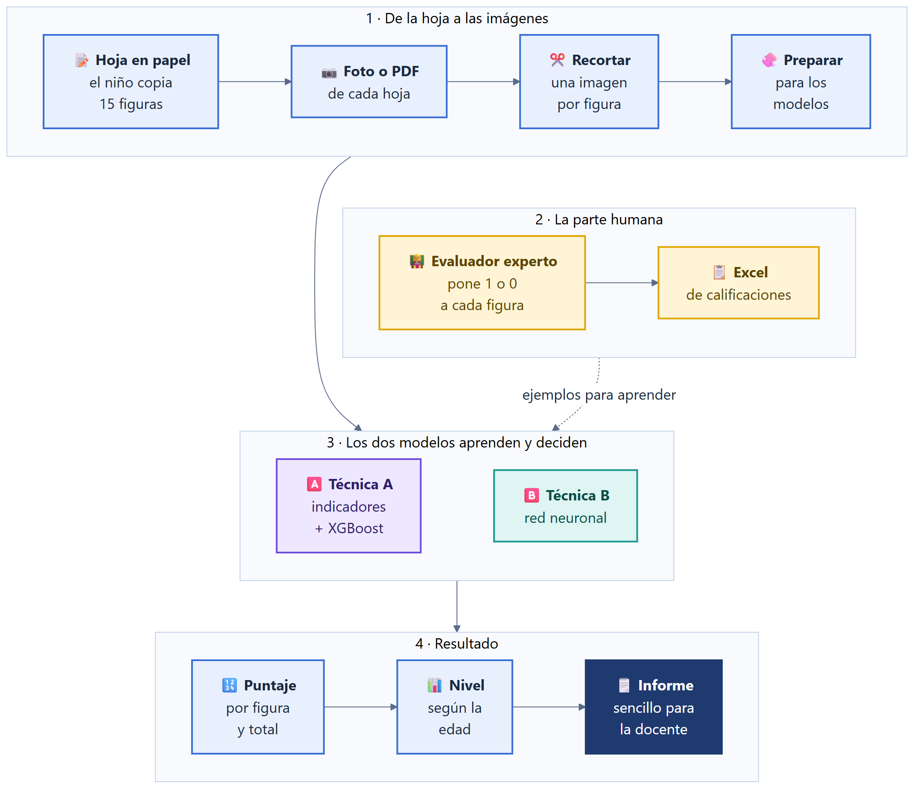
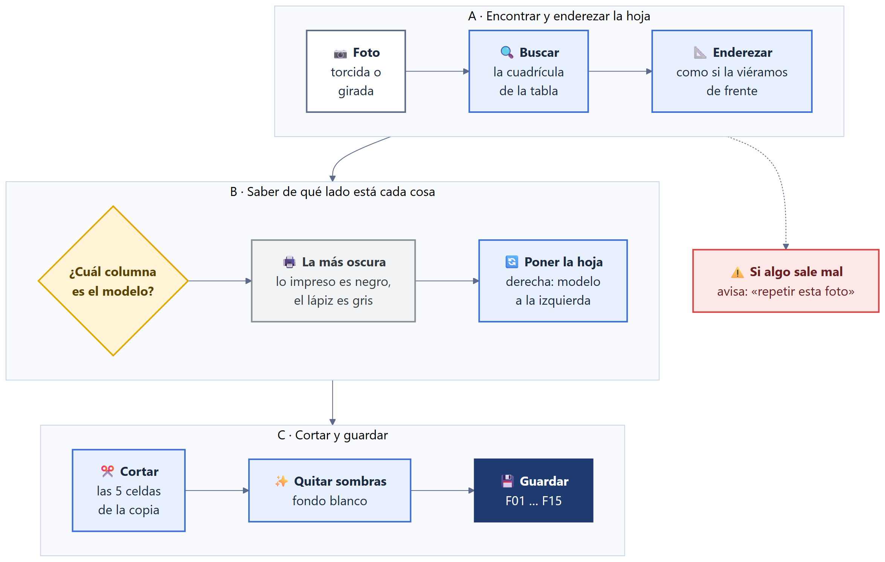
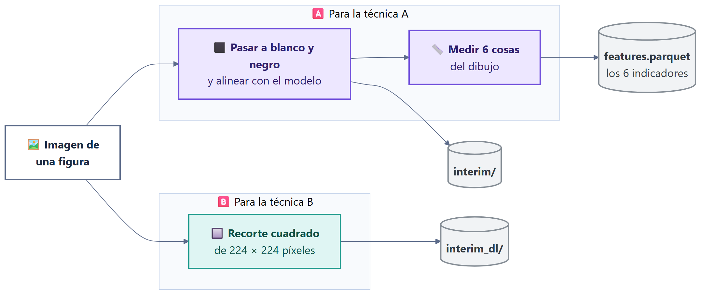
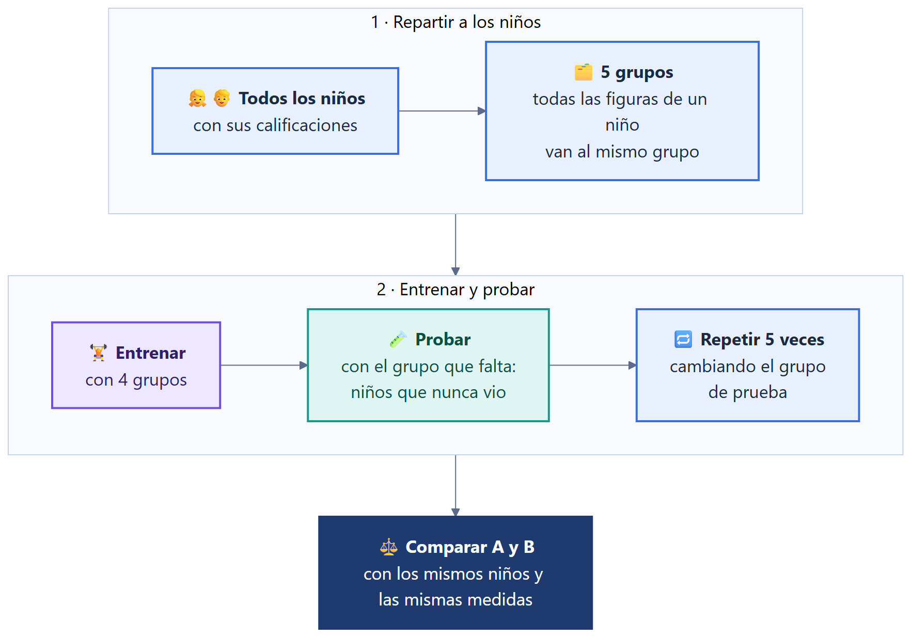
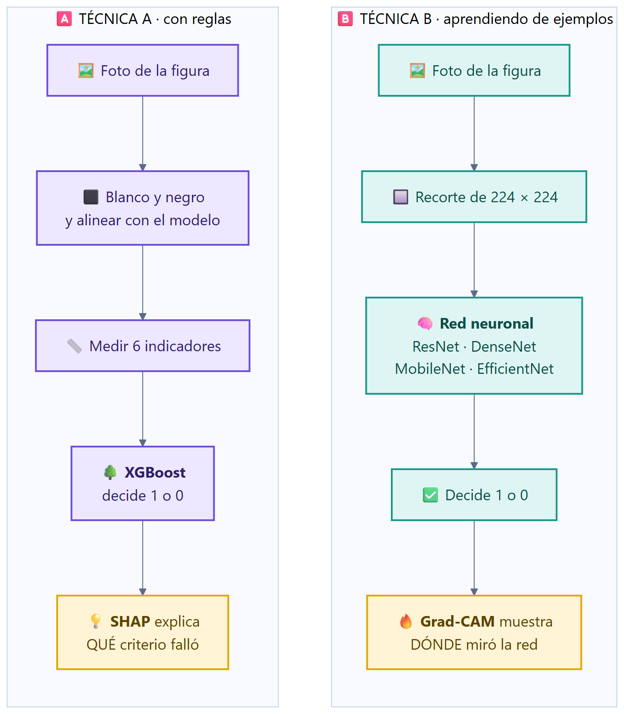
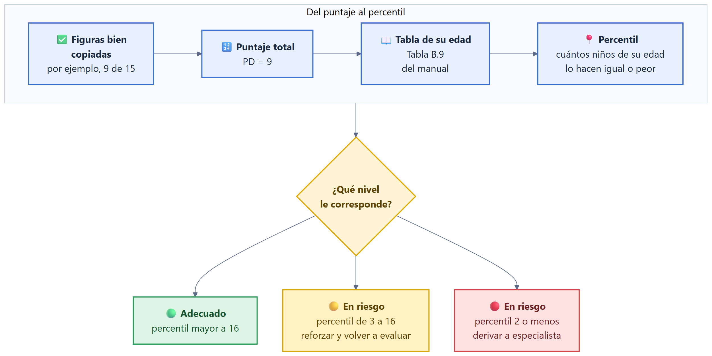
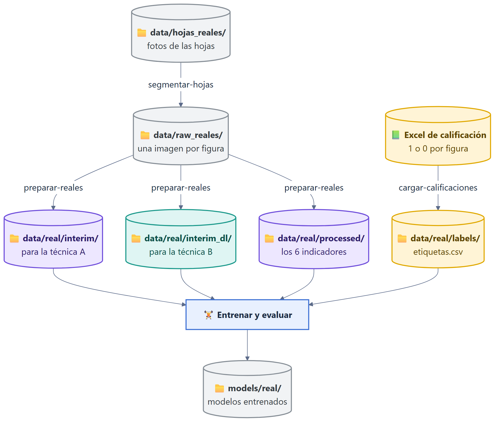
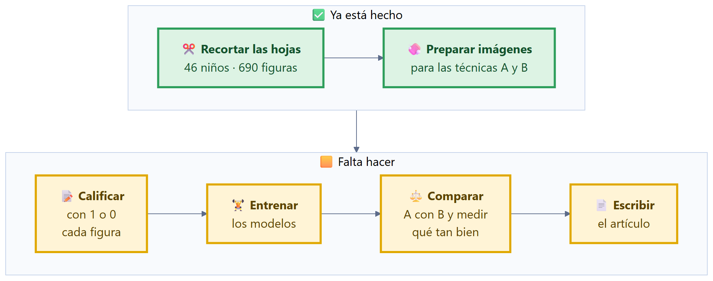

# Guía para principiantes: ¿qué hace este proyecto y cómo funciona?

> Esta guía explica **todo el flujo** con palabras sencillas y dibujos. No hace falta saber
> programación ni inteligencia artificial para entenderla. Si quieres los detalles técnicos,
> al final hay enlaces a los otros documentos.

**Contenido**

1. [La idea en 30 segundos](#1-la-idea-en-30-segundos)
2. [El camino completo, de la hoja al informe](#2-el-camino-completo-de-la-hoja-al-informe)
3. [Paso a paso](#3-paso-a-paso)
4. [Los dos "cerebros" que se comparan](#4-los-dos-cerebros-que-se-comparan)
5. [Del puntaje al nivel del niño](#5-del-puntaje-al-nivel-del-niño)
6. [Dónde queda cada archivo](#6-dónde-queda-cada-archivo)
7. [Cómo se usa: los comandos](#7-cómo-se-usa-los-comandos)
8. [En qué punto está el proyecto](#8-en-qué-punto-está-el-proyecto)
9. [Glosario](#9-glosario)

---

## 1. La idea en 30 segundos

En una prueba para niños de **3 a 5 años**, el niño **copia 15 dibujos** (una línea, una cruz,
un círculo, un cuadrado, un triángulo…). Una persona experta mira cada copia y decide:

- **1** → "está bien copiada"
- **0** → "está mal copiada"

La suma de los 1 es el **puntaje** del niño (de 0 a 15). Con ese puntaje y su edad se sabe si el
niño va como se espera o si necesita apoyo.

**Calificar a mano toma tiempo.** Este proyecto enseña a una computadora a hacerlo a partir de
una **foto de la hoja**. Y, como es una tesis, no se usa una sola técnica, sino **dos**, para
saber cuál funciona mejor:

| | Técnica A (la "clásica") | Técnica B (la "profunda") |
|---|---|---|
| Idea | Medir el dibujo con reglas: ¿tiene esquinas?, ¿está cerrado? | Mostrarle miles de ejemplos a una red neuronal para que aprenda sola |
| Se parece a… | Un profesor que usa una lista de verificación | Un estudiante que aprende viendo muchos ejemplos corregidos |

> ⚠️ Es una **herramienta de apoyo**, no un diagnóstico. La prueba la aplica siempre una
> persona y el sistema solo ayuda a calificar.

---

## 2. El camino completo, de la hoja al informe



<sub>Fuente editable: [`docs/diagramas/fuentes/01_flujo_completo.mmd`](diagramas/fuentes/01_flujo_completo.mmd)</sub>

Lo importante de este dibujo:

- Las cajas **amarillas** son la parte **humana**: alguien experto tiene que calificar
  (con 1 o 0) los dibujos. **Es lo único que la computadora no puede inventar**, porque de ahí
  aprende.
- Sin esas calificaciones, la computadora ve los dibujos pero no sabe cuáles están bien.

---

## 3. Paso a paso

### Paso 1. De la foto de la hoja a una imagen por figura (`segmentar-hojas`)

Una hoja trae **5 figuras**, así que cada niño tiene **3 hojas** (3 × 5 = 15). En cada hoja,
a la izquierda está el **modelo impreso** y a la derecha el **dibujo del niño**.

La foto puede venir torcida, de lado o al revés. La computadora la **endereza y corta** así:



<sub>Fuente editable: [`docs/diagramas/fuentes/02_segmentar_hoja.mmd`](diagramas/fuentes/02_segmentar_hoja.mmd)</sub>

**Truco que usa:** el modelo impreso es **negro fuerte**; el lápiz del niño es **gris**. Con eso
la computadora sabe de qué lado está cada cosa, aunque la hoja venga al revés.

**Si algo sale mal**, avisa en vez de adivinar. Por ejemplo, si la foto corta la tabla, dice
"hay que repetir esta foto".

### Paso 2. Preparar las imágenes para los modelos (`preparar-reales`)

De cada figura se hacen **tres cosas**, sin necesitar todavía las calificaciones:



<sub>Fuente editable: [`docs/diagramas/fuentes/03_preparar_imagenes.mmd`](diagramas/fuentes/03_preparar_imagenes.mmd)</sub>

Los **6 indicadores** que mide la técnica A son como preguntas sobre el dibujo:

| Indicador | La pregunta que responde |
|---|---|
| Parecido general | ¿Se parece al modelo? |
| Esquinas | ¿Tiene el número de esquinas correcto? |
| Inclinación de ángulos | ¿Los ángulos están bien inclinados? |
| Cierre | ¿Las líneas se cierran donde deben? |
| Cruces | ¿Las líneas se cruzan donde deben? |
| Proporción | ¿Las partes tienen un tamaño parecido al modelo? |

### Paso 3. Poner las calificaciones (`cargar-calificaciones`)

El evaluador llena un **Excel**: una fila por niño, una columna por figura (F01 a F15) con
**1 o 0**, y la **edad en meses**. El programa lo convierte en el archivo `etiquetas.csv`, revisa
que no falten datos y avisa de los niños incompletos.

### Paso 4. Entrenar y evaluar

- **Entrenar** es enseñarle a la computadora con los ejemplos corregidos.
- **Evaluar** es ver **qué tan bien lo hace con niños que nunca vio**. Para ser justos, se
  separan niños completos: **todas las figuras de un niño van al mismo grupo**, para que no
  "haga trampa" viendo otra figura del mismo niño.



<sub>Fuente editable: [`docs/diagramas/fuentes/08_evaluacion_justa.mmd`](diagramas/fuentes/08_evaluacion_justa.mmd)</sub>

### Paso 5. El informe para la docente

El resultado se explica en **lenguaje sencillo**: *"Lo que hace bien"*, *"En qué necesita apoyo"*
y *"Qué puedes hacer en el aula"*. Los números técnicos van aparte, para el especialista.

---

## 4. Los dos "cerebros" que se comparan



<sub>Fuente editable: [`docs/diagramas/fuentes/04_dos_tecnicas.mmd`](diagramas/fuentes/04_dos_tecnicas.mmd)</sub>

**Las 4 redes que se prueban** (todas ya vienen "pre-entrenadas" con millones de fotos
cualquiera, y aquí solo se les enseña lo particular de estos dibujos):

| Red | En pocas palabras |
|---|---|
| ResNet-18 | La más simple y rápida, el punto de partida |
| DenseNet-121 | Reutiliza lo que aprendió en cada capa |
| MobileNetV2 | Ligera: funciona hasta en un celular |
| EfficientNet-B0 | Equilibra tamaño y precisión |

**¿Por qué dos técnicas?** Porque la pregunta de la tesis es: *¿le va mejor a la computadora
midiendo con reglas o aprendiendo sola?* Se usan **los mismos niños, las mismas
calificaciones y las mismas medidas** para que la comparación sea justa.

---

## 5. Del puntaje al nivel del niño



<sub>Fuente editable: [`docs/diagramas/fuentes/05_puntaje_a_nivel.mmd`](diagramas/fuentes/05_puntaje_a_nivel.mmd)</sub>

- **Percentil 50** quiere decir "está justo en el medio de los niños de su edad".
- Los cortes **16 y 2** son una convención común en psicología y están marcados como
  **provisionales** hasta confirmarlos con el manual. Se pueden cambiar en un solo archivo
  (`config/config.yaml`) sin tocar el código.

---

## 6. Dónde queda cada archivo



<sub>Fuente editable: [`docs/diagramas/fuentes/06_carpetas.mmd`](diagramas/fuentes/06_carpetas.mmd)</sub>

| Carpeta | Para qué sirve | ¿Se sube a GitHub? |
|---|---|---|
| `src/grafomotor/` | El código del proyecto | ✅ Sí |
| `tests/` | Pruebas que comprueban que el código funciona | ✅ Sí |
| `docs/` | Esta guía y otros documentos | ✅ Sí |
| `config/` | Los ajustes (rutas, cortes, parámetros) | ✅ Sí |
| `data/` | Fotos y datos de los niños | ❌ **Nunca**: son datos de menores |
| `models/` | Modelos ya entrenados | ❌ No (pesan mucho) |

> 🔒 **Regla de oro:** las fotos de los niños **nunca** se suben a internet. Por eso `data/`
> está bloqueada en `.gitignore`.

---

## 7. Cómo se usa: los comandos

Todo se ejecuta con una sola palabra: `grafomotor`. Para ver todos los comandos:

```bash
grafomotor --help
```

Con los **datos reales**, el orden es este (siempre con `--config config/config_real.yaml`):

| # | Comando | Qué hace en palabras simples |
|---|---|---|
| R1 | `grafomotor segmentar-hojas` | Corta cada hoja en una imagen por figura |
| R2 | `grafomotor --config config/config_real.yaml preparar-reales` | Deja las imágenes listas para los modelos |
| R3 | `grafomotor --config config/config_real.yaml cargar-calificaciones` | Pasa el Excel de calificación a `etiquetas.csv` |
| 00 | `grafomotor --config config/config_real.yaml validar` | Revisa si **alcanzan** los datos antes de entrenar |
| 03 | `grafomotor --config config/config_real.yaml entrenar-ml` | Entrena la técnica A |
| 08 | `grafomotor --config config/config_real.yaml entrenar-dl --arq resnet18` | Entrena una red de la técnica B |
| 09 | `grafomotor --config config/config_real.yaml comparar --arq resnet18` | Compara A contra B |

Para **probar que todo funciona sin datos reales**, hay datos inventados:

```bash
grafomotor todo --sinteticos --dl
```

---

## 8. En qué punto está el proyecto



<sub>Fuente editable: [`docs/diagramas/fuentes/07_estado.mmd`](diagramas/fuentes/07_estado.mmd)</sub>

🟩 **Hecho** · 🟨 **Pendiente**

**Lo que falta, en una frase:** que un evaluador experto ponga 1 o 0 a cada figura y escriba la
edad de cada niño. Con eso se entrena y se evalúa.

**Un aviso honesto:** con 46 niños hay pocos ejemplos. Los modelos aprenderán algo, pero los
resultados serán inestables. El comando `curva-aprendizaje` ayudará a ver si **más niños**
mejorarían el resultado.

---

## 9. Glosario

| Palabra | Significado sencillo |
|---|---|
| **Figura** | Uno de los 15 dibujos que el niño copia |
| **Hoja** | Una página con 5 figuras (cada niño tiene 3) |
| **PD (puntaje directo)** | Cuántas figuras salieron bien, de 0 a 15 |
| **Percentil** | Posición del niño frente a otros de su edad. Percentil 20 = el 20 % lo hace igual o peor |
| **Baremo** | La tabla del manual que convierte el puntaje en percentil según la edad |
| **Etiqueta** | La respuesta correcta (1 o 0) que pone la persona experta |
| **Modelo** | El "cerebro" de la computadora que aprende de ejemplos |
| **Entrenar** | Enseñarle al modelo con ejemplos que ya tienen su respuesta |
| **Evaluar** | Ver qué tan bien responde con ejemplos que nunca vio |
| **Indicador** | Una medida del dibujo (por ejemplo, si está cerrado) |
| **Red neuronal** | Un tipo de modelo que aprende mirando muchos ejemplos |
| **XGBoost** | Un modelo que decide combinando muchas reglas simples |
| **SHAP** | Muestra **qué indicador** pesó más en una decisión |
| **Grad-CAM** | Pinta de colores **dónde miró** la red neuronal en la imagen |
| **Kappa de Cohen** | Mide cuánto coinciden dos jueces (por ejemplo, computadora y experto), descontando el azar |
| **Sintético** | Inventado por el programa, solo para probar que el código corre |
| **Pipeline** | Una cadena de pasos donde la salida de uno es la entrada del siguiente |
| **Repositorio** | La carpeta del proyecto guardada en GitHub, con su historial de cambios |

---

## Para saber más

- [`docs/ARQUITECTURA.md`](ARQUITECTURA.md): cómo está construido el sistema (técnico).
- [`docs/DATOS.md`](DATOS.md): formato exacto de las etiquetas y de las carpetas.
- [`docs/EXPLICABILIDAD.md`](EXPLICABILIDAD.md): cómo se explican las decisiones del modelo.
- [`docs/DESARROLLO.md`](DESARROLLO.md): reglas para programar en este proyecto.
- [`docs/BUENAS_PRACTICAS.md`](BUENAS_PRACTICAS.md): qué buenas prácticas sigue el código y por qué.
- [`ESTADO.md`](../ESTADO.md): qué es real y qué es provisional.
